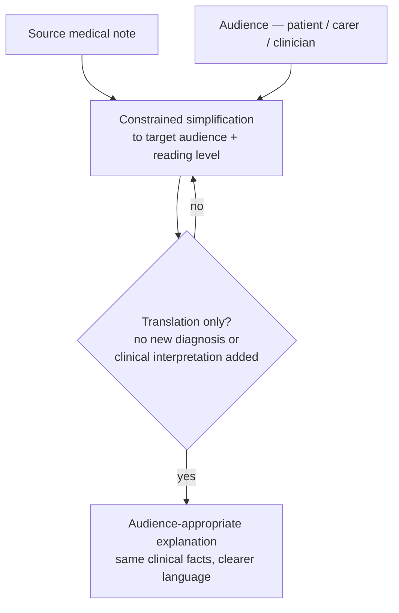
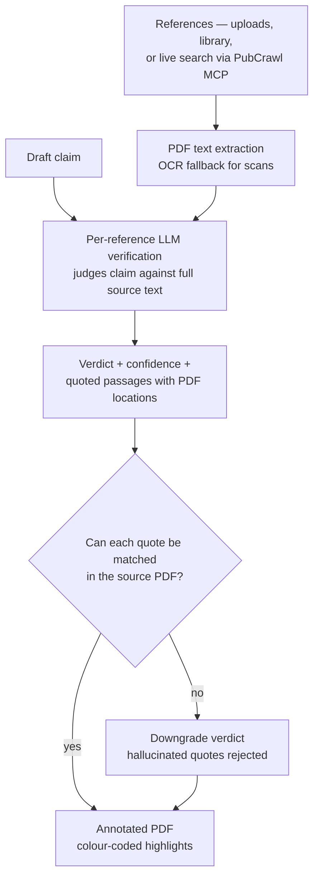
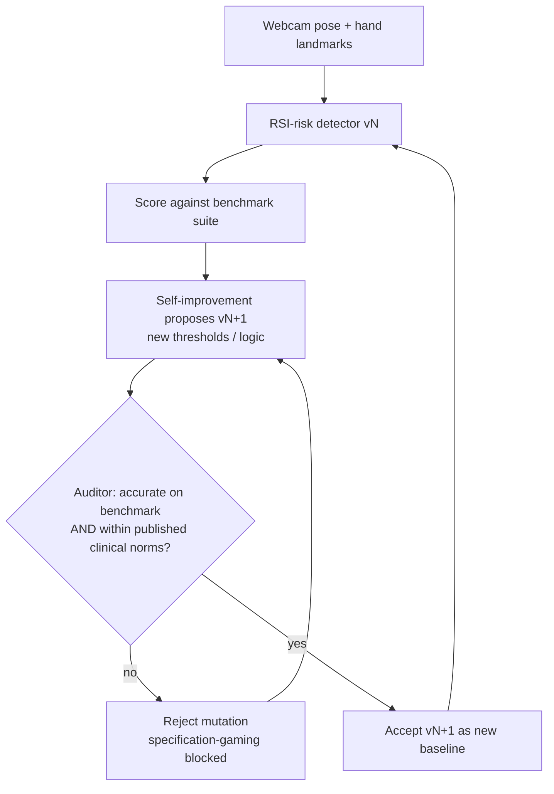

# Hi, I'm Nick Lamb 👋

***I build AI systems that verify before they generate.***

**Applied AI engineer** working on LLM systems for healthcare — verification, regulatory review, patient communication. Particularly interested in constraining model behaviour to reduce harm in high-stakes domains (the subject of my recent publication, below). Founder of [PharmaTools.AI](https://pharmatools.ai), a suite of production AI tools used by clinicians, medical writers, and patients.

## 🧭 How I think about AI

- Retrieve evidence rather than invent it
- Expose uncertainty rather than conceal it
- Constrain capability where consequences are high
- Help humans audit reasoning, not replace judgement

## 📄 Research

**Lamb NJ.** *Translation, not Interpretation: Rethinking Language Model Design for Healthcare.* SN Comprehensive Clinical Medicine. 2026;8:71.  

> Argues that LLMs in healthcare should be **constrained to translational tasks** — restructuring information across clinical, scientific, regulatory and patient-facing domains — rather than performing open-ended interpretation. A scoping argument aligned with capability-control approaches to AI safety: narrower model surface, clearer accountability, lower harm ceiling.

**Lamb NJ.** *Validation of an AI-powered mobile application for personalizing medical note explanations.* medRxiv, 2025.  

> A three-phase validation of Patiently AI — computational readability metrics across 210 outputs, expert review by 15 clinicians, and a 54-patient survey — finding **87.3% of outputs rated clinically safe**, **70% patient preference** over standard notes, and Flesch–Kincaid grade level reduced by ~3. Empirical evidence for the "translation, not interpretation" thesis above, applied in a shipped product.

## 🏆 Featured Products

### [Patiently AI](https://getpatiently.ai) — Patient Communication
Transforms complex medical notes into clear, patient-friendly language.
**Approach:** constrained simplification to a target audience and reading level, gated so the model stays in *translation* — restating what the note already says, never crossing into diagnosis or new clinical interpretation.

**5× Award Winner** — PMEA 2025 (Innovation & Patient Education), Communiqué 2025 Progress Award, HTN AI & Data 2025 (Highly Commended), Best Mobile App Awards.

---

### [RefCheckr](https://refcheckr.pharmatools.ai) — Medical Writing
Verifies clinical claims against supporting references for medical writers and MLR reviewers.
**Approach:** the user's draft claim is judged against each reference by an LLM that must cite verbatim passages; a post-hoc integrity check rejects any citation that can't be located in the source PDF (hallucinated quotes get the verdict downgraded). References can be uploaded PDFs (with OCR fallback) or fetched live from PubMed / ClinicalTrials.gov / DailyMed. Output is an annotated PDF with colour-coded highlights.

---

### [MedCheckr](https://pharmatools.ai) — Regulatory Compliance
AI-powered regulatory review tool that checks promotional claims against the ABPI Code of Practice with clause-level transparency. **Code Clarity Awards Winner, 2024.**
**Approach:** RAG over the ABPI Code corpus with Pinecone vector embeddings; every finding cites the specific clause(s) it relies on, so reviewers can audit each decision.

---

### [PosterLens](https://pharmatools.ai) — Research
Captures scientific posters and generates instant AI summaries. Presented at ESMO AI & Digital Oncology Congress 2025.
**Approach:** mobile vision capture → multimodal LLM extraction into a structured schema (study design, endpoints, results, limitations).

---

### [BiomarkerFinder](https://pharmatools.ai) — Drug Discovery
AI-powered insights into complex biomarker data, explained in plain language. **Winner at Open Targets Hackathon.**
**Approach:** pulls structured biomarker associations from Open Targets and translates them into plain-language explanations with provenance back to the underlying datasets.

---

### [HushMap](https://pharmatools.ai) — Wellbeing
Helps neurodivergent individuals locate sensory-friendly places nearby. Community contributions and Apple Watch support.

## 🔧 Open Source

### [PubCrawl](https://github.com/nickjlamb/pubcrawl) — MCP server for biomedical literature
TypeScript MCP server giving LLM clients direct access to PubMed, ClinicalTrials.gov, FDA DailyMed (USPI), and the UK eMC (SmPC) — including a side-by-side US/UK label comparison tool. Built so models retrieve and reason over real biomedical literature rather than rely on parametric memory. Powers retrieval in RefCheckr; published to npm as `@pharmatools/pubcrawl`, and listed in the official MCP registry.

---

### [RSI Loop](https://github.com/nickjlamb/rsi-loop) — Validated self-improving detector
A computer-vision pipeline that detects RSI risk and *improves its own detection logic* against a benchmark suite — but is gated by a separate regulatory Auditor that rejects mutations producing test-passing but clinically implausible thresholds. A concrete miniature of specification-gaming / reward-hacking mitigation: optimise freely, accept only iterations that are *simultaneously* accurate **and** within published clinical norms.

## 🛠 Tech Stack

**LLM systems:** Claude API · MCP · RAG (Pinecone) · multimodal · structured outputs · evals

**Application:** Node.js · Python · Swift / SwiftUI · Firebase · Postgres

## 📫 Get in Touch

- 🌐 [pharmatools.ai](https://pharmatools.ai)
- 🌐 [medcopywriter.com](https://medcopywriter.com)
- ✉️ nick@pharmatools.ai
- 💼 [LinkedIn](https://www.linkedin.com/in/medcopywriter/)
