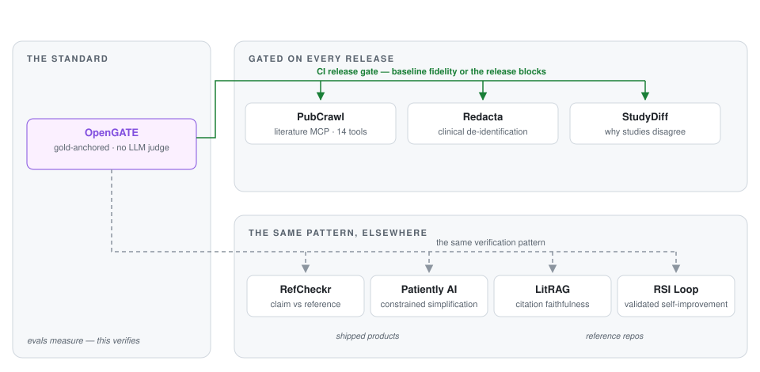

<!--
  Pin order (Settings → Customize your pins), lead with the verification spine:
    1. opengate   2. pubcrawl   3. redacta   4. studydiff
  RSI Loop and LitRAG are concept implementations — pin only if a slot is free.
-->

# Hi, I'm Nick Lamb 👋

***I build AI systems that verify before they generate.***

**Applied AI engineer** working on LLM systems for healthcare — verification, regulatory review, patient communication. Particularly interested in constraining model behaviour to reduce harm in high-stakes domains (the subject of my recent publication, below). Founder of [PharmaTools.AI](https://pharmatools.ai), a suite of production AI tools used by clinicians, medical writers, and patients.

**Highlights:** built a deterministic verification standard ([OpenGATE](https://github.com/nickjlamb/opengate)) · 3,000+ downloads/month across the open-source suite · 2 connectors in [Anthropic's MCP Directory](https://claude.ai/directory/connectors/ant.dir.gh.nickjlamb.redacta) · peer-reviewed publication on capability-constrained LLMs · self-hosted Kubernetes deployment for clinical-text privacy

**Recently:** *Translation, not Interpretation* published in SN Comprehensive Clinical Medicine (2026) · `redacta-mcp` v2 — a stateful privacy boundary that keeps reversal maps out of agent context · a self-hosted Kubernetes deployment for Redacta (Aug 2026)

## 🧭 How I think about AI

- Retrieve evidence rather than invent it
- Expose uncertainty rather than conceal it
- Constrain capability where consequences are high
- Help humans audit reasoning, not replace judgement

## 🛡 The safety thread

The question connecting this work: **how do you keep an AI system inside the envelope where it can be trusted?** My [published position](https://doi.org/10.1007/s42399-026-02316-9) argues for capability control — constraining healthcare LLMs to translation rather than open-ended interpretation, for a narrower surface and a lower harm ceiling. [OpenGATE](https://github.com/nickjlamb/opengate) takes the LLM-as-judge out of evaluation entirely: grounding verification as pure logic, reproducible and ungameable by a persuasive answer. [RSI Loop](https://github.com/nickjlamb/rsi-loop) is a working miniature of specification-gaming mitigation — an optimiser free to mutate, and an auditor that rejects reward-hacked thresholds the benchmark alone would accept. And [redacta-mcp](https://github.com/nickjlamb/redacta) treats agent context as a privacy boundary, keeping re-identification maps out of the model's reach by construction. Different domains, one principle: don't ask the model to police itself.

## 🛠 Tech Stack

**LLM systems:** Claude API · MCP · RAG (Pinecone · FAISS) · multimodal · structured outputs · evals

**Application:** TypeScript · Node.js · Python · Swift / SwiftUI · Firebase · Postgres · Docker · Kubernetes

## 📄 Research

**Lamb NJ.** *Translation, not Interpretation: Rethinking Language Model Design for Healthcare.* SN Comprehensive Clinical Medicine. 2026;8:71.  

> Argues that LLMs in healthcare should be **constrained to translational tasks** — restructuring information across clinical, scientific, regulatory and patient-facing domains — rather than performing open-ended interpretation. A scoping argument aligned with capability-control approaches to AI safety: narrower model surface, clearer accountability, lower harm ceiling.

**Lamb NJ.** *Validation of an AI-powered mobile application for personalizing medical note explanations.* medRxiv, 2025.  

> A three-phase validation of Patiently AI — computational readability metrics across 210 outputs, expert review by 15 clinicians, and a 54-patient survey — finding **87.3% of outputs rated clinically safe**, **70% patient preference** over standard notes, and Flesch–Kincaid grade level reduced by ~3. Empirical evidence for the "translation, not interpretation" thesis above, applied in a shipped product.

## 🔧 Open Source — one verification standard, four production tools

The consumer products further down are underpinned by an open-source spine: **[OpenGATE](https://github.com/nickjlamb/opengate)**, a deterministic grounding-verification standard I built, and the tools it gates. One evaluation standard, four published systems — together several thousand downloads a month, each release checked against a fidelity baseline before it ships.

<picture>
  <source media="(prefers-color-scheme: dark)" srcset="docs/spine-dark.svg">
  
</picture>

| Tool | What it does | Adoption |
|------|--------------|----------|
| **[OpenGATE](https://github.com/nickjlamb/opengate)** | Deterministic grounding verification — no LLM judge |  |
| **[PubCrawl](https://github.com/nickjlamb/pubcrawl)** | MCP server for biomedical literature (14 tools) |  |
| **[Redacta](https://github.com/nickjlamb/redacta)** | De-identify clinical text before it reaches an AI |  |
| **[StudyDiff](https://github.com/nickjlamb/studydiff)** | Explains why two studies disagree, grounded in source |  |

---

### [OpenGATE](https://github.com/nickjlamb/opengate) — the verification spine
**Deterministic, gold-anchored verification for evidence-grounded AI — no LLM judge.** OpenGATE answers one question: *can a system prove its answer from the evidence it was given?* Required facts must be present, every number must trace back to source, and when the context can't answer, the system must abstain rather than fabricate. Because the check is pure logic — not a grader model — it's reproducible, free, and fast enough to run on every answer or gate on every commit. It's the pattern behind RefCheckr and Patiently AI, published as a standalone standard and wired in as a CI release gate on the tools below.

> **It catches real regressions.** Wired into PubCrawl's release pipeline, OpenGATE flagged a records-shape inconsistency (an author list serialised as a string instead of an array) *before* it shipped — the kind of silent parser regression that would quietly poison every downstream grounding claim. Fixed, gated, and now green at 100% retrieval fidelity across PubMed and Europe PMC on every release.

---

### [PubCrawl](https://github.com/nickjlamb/pubcrawl) — MCP server for biomedical literature
TypeScript MCP server giving LLM clients direct access to PubMed, **Europe PMC**, ClinicalTrials.gov, FDA DailyMed (USPI), and the UK eMC (SmPC) — 14 tools in all, including a side-by-side US/UK label comparison. Built so models retrieve and reason over real biomedical literature rather than rely on parametric memory. Powers retrieval in RefCheckr; **gated by OpenGATE on every release** (100% retrieval fidelity across PubMed and Europe PMC). Published to npm as `@pharmatools/pubcrawl` and listed in the official MCP registry.

---

### [Redacta](https://github.com/nickjlamb/redacta) — de-identify clinical text before it reaches an AI
One detection engine shipped across nine surfaces — an iOS app, an agent skill, an MCP server, TypeScript and Python libraries, a CLI, two whiteboard plugins, and a self-hosted HTTP service with a plain-YAML Kubernetes deployment, so the privacy boundary can run inside an organisation's own cluster — with the multi-replica state trade-offs [documented](https://github.com/nickjlamb/redacta/blob/main/docs/KUBERNETES.md) rather than hidden. It replaces patient identifiers with labelled tokens (`[PATIENT_NAME_1]`, `[NHS_NUMBER_1]`, …) while leaving the clinical meaning intact, and it works in reverse: redact → process elsewhere → re-identify locally, so real identifiers never leave your machine. Deterministic pattern-matching (Modulus-11-validated NHS numbers, NI numbers, dates, postcodes) with an optional reasoning layer for free-text names, plus a HIPAA Safe Harbor mode. It's adversarially evaluated by [Redacta Gauntlet](https://github.com/nickjlamb/redacta-gauntlet) — 28 hostile cases spanning mangled formats, near-miss identifiers, prompt injection and context leakage, with a published threat model.

---

### [StudyDiff](https://github.com/nickjlamb/studydiff) — why two studies reach different conclusions
Give it two papers and it extracts each one's design, surfaces the methodological differences that could explain a disagreement (a cell type, a dose, a follow-up window), and ranks the likely drivers — grounding **every** statement in the source text, so it never invents a finding. Any field the source doesn't state is shown as *not reported*, never inferred; grounding runs **first**, so a fact that can't be verified is downgraded before it's ever used as a reason. Verification is deterministic (OpenGATE) — no second LLM acting as judge. Built for the *Built with Claude: Life Sciences* hackathon; shipped as an MCP server so any agent can ask *why do these papers disagree?* as a tool call.

---

*Concept implementations — the verification patterns above, distilled into small, readable reference repos:*

### [RSI Loop](https://github.com/nickjlamb/rsi-loop) — validated self-improving detector
A computer-vision pipeline that detects RSI risk and *improves its own detection logic* against a benchmark suite — but is gated by a separate regulatory Auditor that rejects mutations producing test-passing but clinically implausible thresholds. A concrete miniature of specification-gaming / reward-hacking mitigation: optimise freely, accept only iterations that are *simultaneously* accurate **and** within published clinical norms.

---

### [LitRAG](https://github.com/nickjlamb/litrag) — grounded RAG with a built-in citation-faithfulness eval
A small, readable RAG pipeline over PubMed abstracts that doesn't stop at "it retrieved something and answered" — it **checks whether each generated claim is actually supported by its cited source**, and flags hallucinated or unsupported ones. A deterministic quote-locator catches fabricated citations for free; an LLM-as-judge then grades support level (supports / partial / contradicts / not-found) from the passage alone. Embedding and retrieval run fully local (Hugging Face sentence-transformers + FAISS — no managed vector-DB key); only generation and the judge call an LLM. It's the citation-faithfulness pattern behind RefCheckr, distilled into an open reference implementation, with its corpus pulled via PubCrawl.

## 🏆 Featured Products

### [Patiently AI](https://getpatiently.ai) — Patient Communication
Transforms complex medical notes into clear, patient-friendly language.
**Approach:** constrained simplification to a target audience and reading level, gated so the model stays in *translation* — restating what the note already says, never crossing into diagnosis or new clinical interpretation.

**5× Award Winner** — PMEA 2025 (Innovation & Patient Education), Communiqué 2025 Progress Award, HTN AI & Data 2025 (Highly Commended), Best Mobile App Awards.

---

### [RefCheckr](https://refcheckr.pharmatools.ai) — Medical Writing
Verifies clinical claims against supporting references for medical writers and MLR reviewers.
**Approach:** the user's draft claim is judged against each reference by an LLM that must cite verbatim passages; a post-hoc integrity check rejects any citation that can't be located in the source PDF (hallucinated quotes get the verdict downgraded). References can be uploaded PDFs (with OCR fallback) or fetched live from PubMed / ClinicalTrials.gov / DailyMed. Output is an annotated PDF with colour-coded highlights.

---

### Also shipped

| Product | Domain | Of note |
|---|---|---|
| **[MedCheckr](https://apps.apple.com/app/medcheckr-abpi/id6737439961)** | ABPI regulatory review | **Code Clarity Awards Winner 2024** — RAG over the ABPI Code with clause-level citations, so every finding is auditable |
| **[PosterLens](https://apps.apple.com/app/posterlens/id6744457926)** | Scientific posters | Presented at **ESMO AI & Digital Oncology Congress 2025** — on-device OCR, structured extraction, PubMed-validated citations |
| **[BiomarkerFinder](https://pharmatools.ai)** | Drug discovery | **Open Targets Hackathon winner** — biomarker associations translated to plain language with provenance |
| **[HushMap](https://apps.apple.com/app/hushmap/id6742574192)** | Wellbeing | Sensory-friendly place finder for neurodivergent users — community contributions, Apple Watch |

## 📫 Get in Touch

- 🌐 [pharmatools.ai](https://pharmatools.ai)
- 🌐 [medcopywriter.com](https://medcopywriter.com)
- ✉️ nick@pharmatools.ai
- 💼 [LinkedIn](https://www.linkedin.com/in/medcopywriter/)

---
