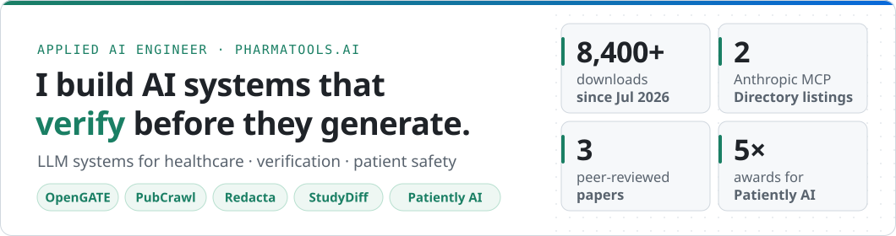

<!--
Pin order (Settings → Customize your pins), lead with the verification spine:
  1. opengate   2. pubcrawl   3. redacta   4. studydiff
RSI Loop and LitRAG are concept implementations — pin only if a slot is free.
-->
<picture>
<source media="(prefers-color-scheme: dark)" srcset="assets/header-dark.svg">

</picture>

# Hi, I'm Nick 👋

**Applied AI engineer** building LLM systems for healthcare: verification, regulatory review and patient communication. Founder of [PharmaTools.AI](https://pharmatools.ai), a suite of production AI tools used by clinicians, medical writers and patients.

## 🧭 How I think about AI

- Retrieve evidence rather than invent it
- Expose uncertainty rather than conceal it
- Constrain capability where consequences are high
- Help humans audit reasoning, not replace judgement

**The thread through my work:** don't ask the model to police itself. My [published position](https://doi.org/10.1007/s42399-026-02316-9) argues for constraining healthcare LLMs to translation rather than interpretation. [OpenGATE](https://github.com/nickjlamb/opengate) replaces the LLM judge with deterministic checks, [RSI Loop](https://github.com/nickjlamb/rsi-loop) shows an auditor rejecting reward-hacked self-improvements, and [Redacta](https://github.com/nickjlamb/redacta) keeps re-identification maps out of the model's reach by construction.

## 🔧 Open source: one verification standard, four production tools

<picture>
<source media="(prefers-color-scheme: dark)" srcset="docs/spine-dark.svg">

</picture>

| Tool | What it does | Adoption |
|------|--------------|----------|
| **[OpenGATE](https://github.com/nickjlamb/opengate)** | Deterministic grounding verification with no LLM judge. Runs as a CI release gate on the tools below |  |
| **[PubCrawl](https://github.com/nickjlamb/pubcrawl)** | MCP server for PubMed, Europe PMC, ClinicalTrials.gov and US/UK drug labels (14 tools) |  |
| **[Redacta](https://github.com/nickjlamb/redacta)** | De-identifies clinical text before it reaches an AI, then re-identifies locally. Nine surfaces, including a self-hosted Kubernetes service |  |
| **[StudyDiff](https://github.com/nickjlamb/studydiff)** | Explains why two studies disagree, grounding every statement in the source ([live demo](https://studydiff.pharmatools.ai)) |  |

**Reference implementations:** [RSI Loop](https://github.com/nickjlamb/rsi-loop) (validated self-improvement with an auditor that blocks specification gaming) · [LitRAG](https://github.com/nickjlamb/litrag) (RAG with a built-in citation-faithfulness eval)

## 📄 Research

- **Observer Zero: Do LLM Agents Form Epistemic Communities?** Preprint, 2026. [DOI](https://doi.org/10.5281/zenodo.21906653) · [code](https://github.com/nickjlamb/observer-zero) Across 235 runs (85 pre-registered), LLM agents detected a hidden change of physical law in 90–100% of worlds but correctly diagnosed it in **0 of 40** opportunities.
- **Translation, not Interpretation: Rethinking Language Model Design for Healthcare.** *SN Comprehensive Clinical Medicine*, 2026. [DOI](https://doi.org/10.1007/s42399-026-02316-9) Argues for constraining healthcare LLMs to translational tasks: a narrower surface and a lower harm ceiling.
- **Validation of an AI-powered mobile application for personalizing medical note explanations.** *Frontiers in Digital Health*, 2026. [DOI](https://doi.org/10.3389/fdgth.2026.1771051) Patiently AI: **87.3%** of outputs rated clinically safe by experts, **70%** patient preference, reading level down ~3 grades.
- **A Day in the Life of an MSL Powered by AI.** *JNGR 5.0*, 2025. [PDF](https://cdn.prod.website-files.com/66d49e8555a289120a81ec3e/67f0e0db19c70b8c590d7a89_JNGR.pdf) A design proposal for an AI-powered Medical Science Liaison (MSL) training platform, combining RAG for personalised content, multimodal mechanism-of-action visualisation and explainable recommendations.

## 🏆 Products

| Product | What it does | Of note |
|---|---|---|
| **[Patiently AI](https://getpatiently.ai)** | Turns medical notes into patient-friendly language, without crossing into diagnosis | 5× award winner · peer-reviewed validation · [iOS](https://apps.apple.com/app/patiently-ai/id6670164706) / [Android](https://play.google.com/store/apps/details?id=ai.patiently.app) / web |
| **[RefCheckr](https://refcheckr.pharmatools.ai)** | Checks clinical claims against references; rejects any quote it can't find in the source | Web app · [Word add-in](https://marketplace.microsoft.com/en-us/product/WA200010362?tab=Overview) |
| **[MedCheckr](https://apps.apple.com/app/medcheckr-abpi/id6737439961)** | ABPI Code review with clause-level citations | Code Clarity Awards Winner 2024 |
| **[PosterLens](https://apps.apple.com/app/posterlens/id6744457926)** | Structured extraction from scientific posters | Presented at ESMO AI & Digital Oncology 2025 |
| **[BiomarkerFinder](https://pharmatools.ai)** | Biomarker associations in plain language, with provenance | Open Targets Hackathon winner |
| **[HushMap](https://apps.apple.com/app/hushmap/id6742574192)** | Sensory-friendly place finder for neurodivergent users | Community-sourced · Apple Watch |

## 🛠 Stack

**LLM systems:** Claude API · MCP · RAG (Pinecone, FAISS) · structured outputs · evals 
**Application:** TypeScript · Python · Swift · Postgres · Docker · Kubernetes

📫 [pharmatools.ai](https://pharmatools.ai) · nick@pharmatools.ai · [LinkedIn](https://www.linkedin.com/in/medcopywriter/)
